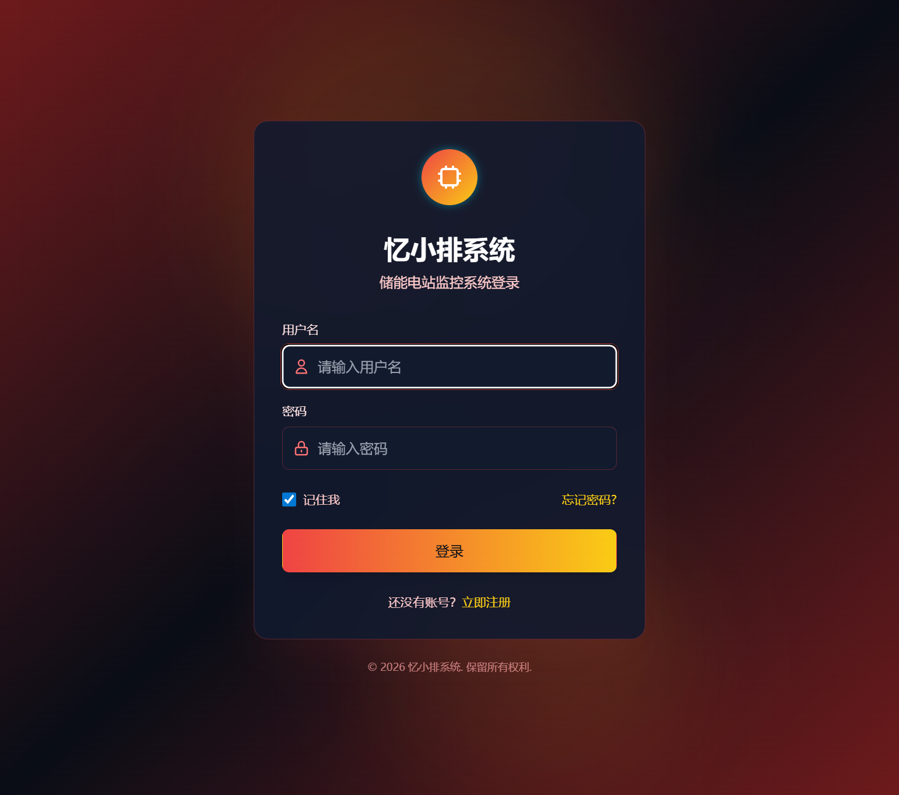

# 储能电站监控系统 - 忆小排

> 🔋 基于 React + ECharts 的工业级储能电站数据可视化大屏监控系统

## 📸 项目预览



## ✨ 功能特点

### 核心功能
- 📊 **实时监控仪表盘** - 温度场可视化、设备状态、告警统计
- 🔋 **电池状态监测** - 电压、电流、SOC、SOH 实时数据
- 🌡️ **温度趋势分析** - 历史温度数据图表，支持筛选
- ⚠️ **智能告警系统** - 多级告警、历史记录、告警处理
- 🔧 **设备管理** - 设备列表、状态监控、故障诊断
- 👤 **用户权限管理** - 基于角色的权限控制系统

### 技术亮点
- 🚀 **性能优化** - 代码分割、懒加载、数据缓存，首屏加载 < 0.1s
- 📱 **响应式设计** - 支持各种屏幕尺寸
- 🎨 **现代化UI** - 深色工业风格，专业大屏展示
- 📈 **丰富的图表** - 3D 图表、仪表盘、热力图等
- 🔐 **安全可靠** - 完善的权限控制机制

## 🛠️ 技术栈

| 技术 | 版本 | 说明 |
|------|------|------|
| React | 19.2.0 | 前端框架 |
| TypeScript | 5.9.3 | 类型安全 |
| Vite | 7.3.1 | 构建工具 |
| ECharts | 5.4.3 | 图表库 |
| ECharts-GL | 2.0.9 | 3D 图表 |
| Tailwind CSS | 3.4.19 | CSS 框架 |
| React Router | 7.13.1 | 路由管理 |
| Express | 5.2.1 | 后端服务 |
| SQLite | 6.0.1 | 数据库 |

## 📦 包含功能模块

| 模块 | 说明 |
|------|------|
| Dashboard | 系统概览仪表盘 |
| RealTimeMonitoring | 实时监控 |
| HistoricalData | 历史数据查询 |
| AlertManagement | 告警管理 |
| DeviceManagement | 设备管理 |
| DeviceMaintenance | 设备维护 |
| SystemSettings | 系统设置 |
| UserManagement | 用户管理 |
| LogManagement | 日志管理 |
| DataAnalysis | 数据分析 |
| ReportManagement | 报表管理 |

## 🚀 快速开始

```bash
# 安装依赖
npm install

# 启动开发服务器
npm run dev

# 构建生产版本
npm run build

# 预览构建结果
npm run preview
```

## 🔑 登录账号

| 角色 | 用户名 | 密码 | 权限 |
|------|--------|------|------|
| 系统管理员 | admin | admin123 | 全部权限 |
| 运维人员 | operator | operator123 | 运维操作 |
| 工程师 | engineer01 | engineer123 | 技术操作 |
| 访客 | viewer | viewer123 | 只读访问 |

## 📁 目录结构

```
src/
├── components/          # 可复用组件
│   ├── Navbar.tsx      # 顶部导航
│   ├── Sidebar.tsx     # 侧边菜单
│   └── dashboard/      # 仪表盘组件
├── pages/              # 页面组件
│   ├── Dashboard.tsx   # 仪表盘
│   ├── RealTimeMonitoring.tsx
│   ├── HistoricalData.tsx
│   └── ...
├── routes/             # 路由配置
├── services/           # API 服务
├── utils/              # 工具函数
└── styles/             # 样式文件
```

## 💼 商业授权

本项目源码可用于：
- ✅ 个人学习研究
- ✅ 企业内部使用
- ✅ 二次开发后商业使用
- ✅ 作为项目案例展示

## 📞 技术支持

购买后提供：
- 完整源码
- 部署文档
- 技术咨询（30天）
- 免费更新

---

© 2026 忆小排系统 | 专业储能电站监控解决方案
