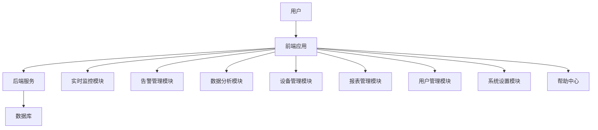

# 储能安全防护系统 - 系统描述文档

## 1. 系统概述

储能安全防护系统是一套专为储能电站设计的监控和管理系统，旨在确保储能设备的安全运行和高效管理。系统提供实时监控、告警管理、数据分析等功能，帮助运维人员及时发现和处理潜在问题。

### 1.1 系统目标
- 实时监控储能设备的运行状态
- 及时发现和处理告警信息
- 提供数据分析和报表功能
- 确保系统的安全稳定运行
- 提高运维效率和管理水平

### 1.2 适用场景
- 大型储能电站
- 分布式储能系统
- 微电网储能系统
- 工商业储能系统

## 2. 系统架构

### 2.1 前端架构
- **技术栈**：React 19 + TypeScript + Vite
- **状态管理**：React Context API
- **路由管理**：React Router v7
- **UI组件**：自定义组件 + Tailwind CSS v3
- **数据可视化**：ECharts 5 + ECharts GL
- **样式方案**：Tailwind CSS + 自定义工具类

### 2.2 后端架构
- **技术栈**：Express.js
- **部署方式**：静态文件服务 + API服务

### 2.3 系统结构

## 3. 功能模块

### 3.1 系统概览
- 系统运行状态总览
- 关键指标实时监控
- 系统健康度评估
- 设备在线状态

### 3.2 实时监控
- 设备实时数据采集
- 数据可视化展示
- 多维度数据监控
- 异常状态实时告警

### 3.3 设备管理
- 设备信息管理
- 设备状态监控
- 设备参数配置
- 设备历史记录

### 3.4 告警管理
- 告警信息展示
- 告警级别分类
- 告警处理流程
- 告警规则配置
- 告警统计分析

### 3.5 数据分析
- 性能分析
- 能耗分析
- 告警分析
- 设备分析
- 趋势分析

### 3.6 报表管理
- 报表生成
- 报表导出（Excel、PDF）
- 报表模板管理
- 定时报表

### 3.7 用户管理
- 用户信息管理
- 权限控制
- 角色管理
- 登录日志

### 3.8 日志管理
- 系统日志
- 操作日志
- 设备日志
- 日志查询和分析

### 3.9 系统设置
- 系统配置
- 参数设置
- 通知设置
- 安全设置

### 3.10 设备维护
- 维护计划管理
- 维护记录
- 设备检修
- 维护提醒

### 3.11 通知管理
- 通知设置
- 通知历史
- 通知模板
- 通知推送

### 3.12 帮助中心
- 系统文档
- 常见问题
- 使用指南
- 联系支持

## 4. 核心功能

### 4.1 实时数据采集与监控
- 支持多设备、多参数的实时数据采集
- 数据更新频率可配置
- 数据异常自动检测
- 多维度数据可视化展示

### 4.2 智能告警系统
- 多级告警机制（紧急、严重、警告、信息）
- 告警规则自定义
- 告警通知多渠道（系统内、邮件、短信）
- 告警处理流程管理

### 4.3 数据分析与报表
- 多维度数据分析
- 趋势分析和预测
- 自定义报表生成
- 定时报表自动发送

### 4.4 设备生命周期管理
- 设备信息全生命周期跟踪
- 维护计划自动生成
- 设备健康状态评估
- 设备退役管理

### 4.5 系统安全管理
- 基于角色的权限控制
- 操作日志记录
- 安全审计
- 数据加密传输

## 5. 技术特性

### 5.1 前端技术特性
- 响应式设计，支持多设备访问
- 实时数据更新，支持WebSocket
- 高性能数据可视化
- 模块化组件设计
- 代码分割，优化加载性能

### 5.2 后端技术特性
- 高性能API设计
- 数据缓存机制
- 错误处理与日志
- 安全认证与授权

### 5.3 系统性能优化
- 前端性能优化（代码分割、懒加载）
- 后端性能优化（缓存、数据库优化）
- 网络优化（压缩、CDN）
- 资源使用优化

## 6. 系统部署

### 6.1 部署环境
- Node.js 18+
- npm/pnpm/yarn
- Express.js
- 静态文件服务器

### 6.2 部署步骤
1. 克隆代码仓库
2. 安装依赖：`npm install`
3. 构建项目：`npm run build`
4. 启动服务器：`node server.js`

### 6.3 访问方式
- 本地访问：http://localhost:3000
- 网络访问：http://[服务器IP]:3000

## 7. 系统维护

### 7.1 日常维护
- 系统日志检查
- 数据库备份
- 系统更新
- 安全补丁

### 7.2 故障排查
- 日志分析
- 性能监控
- 网络诊断
- 数据库检查

### 7.3 系统升级
- 版本管理
- 升级流程
- 数据迁移
- 回滚机制

## 8. 技术栈

| 类别 | 技术 | 版本 | 用途 |
|------|------|------|------|
| 前端框架 | React | 19.2.0 | 构建用户界面 |
| 类型系统 | TypeScript | 5.9.3 | 类型安全 |
| 构建工具 | Vite | 7.3.1 | 开发和构建 |
| 路由管理 | React Router | 7.13.1 | 页面路由 |
| 样式方案 | Tailwind CSS | 3.4.19 | 样式管理 |
| 数据可视化 | ECharts | 5.4.3 | 图表展示 |
| 3D可视化 | ECharts GL | 2.0.9 | 3D图表 |
| 后端框架 | Express | 5.2.1 | API服务 |
| 开发工具 | ESLint | 9.39.1 | 代码质量 |

## 9. 系统安全

### 9.1 安全措施
- 身份认证与授权
- 数据加密传输
- 输入验证与 sanitization
- 防止SQL注入
- 防止XSS攻击
- 防止CSRF攻击

### 9.2 安全审计
- 操作日志记录
- 登录日志分析
- 异常行为检测
- 安全事件响应

## 10. 未来规划

### 10.1 功能扩展
- AI预测分析
- 自动化运维
- 移动端应用
- 多语言支持

### 10.2 技术升级
- 微服务架构
- 容器化部署
- 云原生支持
- 边缘计算集成

### 10.3 生态系统
- 第三方系统集成
- API开放平台
- 插件系统
- 社区建设

## 11. 结论

储能安全防护系统是一款功能全面、技术先进的储能电站监控和管理系统，通过实时监控、智能告警、数据分析等功能，为储能电站的安全运行和高效管理提供了有力保障。系统采用现代前端技术栈，具有良好的用户体验和性能表现，可满足不同规模储能系统的需求。

随着储能行业的快速发展，系统将不断迭代升级，引入更多先进技术和功能，为储能电站的安全运行和智能化管理提供更加全面的支持。